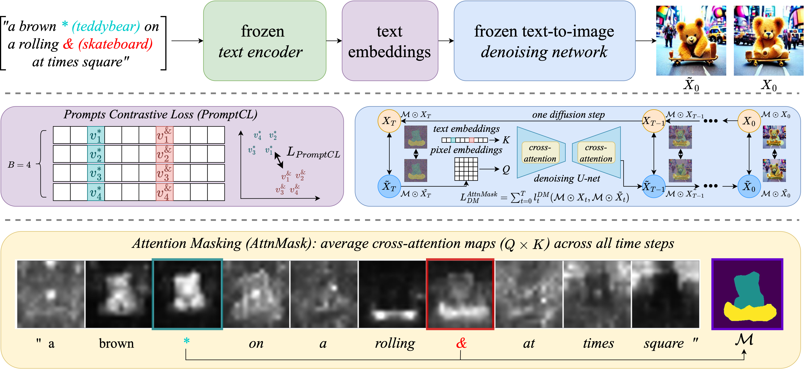

# An Image is Worth Multiple Words: Discovering Object Level Concepts using Multi-Concept Prompt Learning (ICML 2024)

### [Official Code](https://github.com/AstraZeneca/MCPL/tree/master)&ensp;&ensp;&ensp;
### 
### [Project Page](https://astrazeneca.github.io/mcpl.github.io/)&ensp;&ensp;&ensp;

